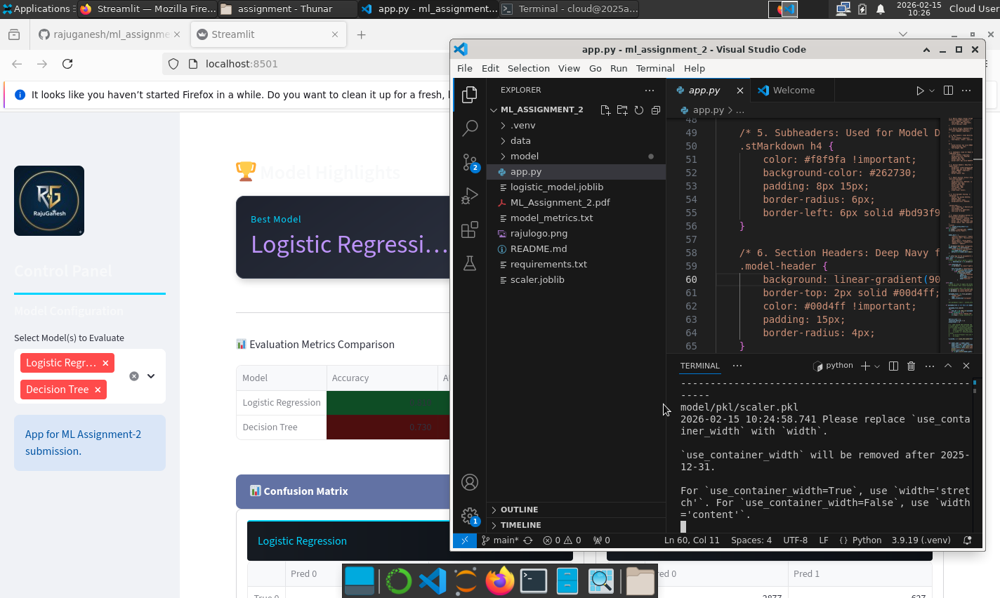
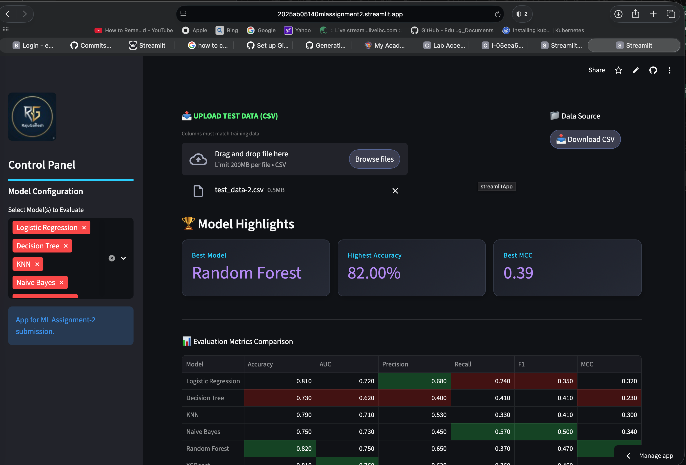

# ML Assignment 2 Submission: M.Tech (AIML/DSE)

**Student Name:** RAJU GANESH A

**BITS ID:** 2025ab05140

**Submission Date:** 15-02-2026

---

## 1. Mandatory Submission Links

**GitHub Repository Link:** https://github.com/rajuganesh/ml_assignment_2.git

 
**Live Streamlit App Link:** https://2025ab05140mlassignment2.streamlit.app 

---

## 2. BITS Virtual Lab Execution Screenshot

---

## 3. GitHub README Documentation

The following content is also included in the repository README.md.

## a. Problem Statement

The objective of this project is to develop and implement multiple machine learning classification models to predict whether a credit card client will default on their payment next month. By comparing six different algorithms, we identify which model provides the most reliable predictions based on a specific set of evaluation metrics, including MCC and AUC scores.

## b. Dataset Description

The dataset used in this assignment is the **Bank Marketing Dataset**, which contains information regarding direct marketing campaigns (phone calls) of a Portuguese banking institution. The task is to predict whether a client will subscribe to a term deposit (binary classification).

## b. Dataset Description 

* **Source:** UCI Machine Learning Repository / Kaggle.

* **Instance Size:** 30,000 observations (Meets the requirement of >500).

* **Feature Size:** 24 attributes (Meets the requirement of >12).

* **Target Variable:** `default.payment.next.month` (Binary: 1 = yes, 0 = no).

### Features List

1. **ID:** Client ID.
2. **LIMIT_BAL:** Amount of given credit.
3. **SEX:** Gender (1=male, 2=female).
4. **EDUCATION:** (1=grad school, 2=university, 3=high school, 4=others).
5. **MARRIAGE:** Marital status (1=married, 2=single, 3=others).
6. **AGE:** Age in years.
7. **PAY_0 to PAY_6:** Repayment status from April to September 2005.
8. **BILL_AMT1 to BILL_AMT6:** Bill statement amount from April to September 2005.
9. **PAY_AMT1 to PAY_AMT6:** Previous payment amount from April to September 2005.

### Data Composition

* **Instance Count**: Each row represents a specific client interaction during a marketing campaign.
* **Target Variable**: The target label is binary (`y`), indicating whether the client subscribed to a term deposit ("yes" or "no").
* **Feature Categories**:
* **Bank Client Data**: Includes attributes such as age, job type, marital status, education level, and current balance.
* **Loan Status**: Indicators for existing housing loans, personal loans, or credit defaults.
* **Campaign Data**: Information regarding the contact method, day, and month of the last contact.

### Preprocessing Pipeline

To ensure the models were trained and evaluated effectively, the following preprocessing steps were implemented:

* **Separator Handling**: The raw CSV data utilizes a semicolon (`;`) as a separator, which is handled during the data loading phase to ensure correct dataframe construction.
* **Categorical Encoding**: Non-numerical features (such as `job` or `education`) are converted into numerical formats suitable for machine learning algorithms.
* **Feature Scaling**: Numerical features are normalized using **Standard Scaling**. This ensures that features with larger ranges do not dominate the distance-based models like KNN and Logistic Regression.
* **Persistence**: A pre-trained `scaler.pkl` object is utilized to ensure that the test data is transformed using the exact same parameters (mean and variance) as the training set.

### Class Distribution

* **Imbalance**: The dataset exhibits a significant class imbalance, with a majority of clients not subscribing to the term deposit.
* **Evaluation Strategy**: Due to this imbalance, the project prioritizes **MCC (Matthews Correlation Coefficient)** and **F1-Score** over simple Accuracy to accurately assess model performance.

## c. Models Used and Comparison Table 

The following six models were implemented and evaluated on the same dataset:

| ML Model Name | Accuracy | AUC | Precision | Recall | F1 | MCC |
| --- | --- | --- | --- | --- | --- | --- |
| **Logistic Regression** | 0.81 | 0.71 | 0.68 | 0.24 | 0.35 | 0.32 |
| **Decision Tree** | 0.73 | 0.61 | 0.39 | 0.41 | 0.40 | 0.22 |
| **k-Nearest Neighbor** | 0.79 | 0.70 | 0.54 | 0.35 | 0.42 | 0.31 |
| **Naive Bayes** | 0.75 | 0.73 | 0.45 | 0.57 | 0.50 | 0.34 |
| **Random Forest (Ensemble)** | 0.81 | 0.76 | 0.63 | 0.36 | 0.46 | 0.38 |
| **XGBoost (Ensemble)** | 0.81 | 0.76 | 0.61 | 0.36 | 0.46 | 0.37 |

## d. Performance Observations 

Based on the metrics calculated, the following observations were noted:

| ML Model Name | Observation about model performance |
| --- | --- |
| **Logistic Regression** | High accuracy (81%) but poor recall (24%), indicating it struggles to identify actual defaulters. |
| **Decision Tree** | Lowest AUC (0.61), suggesting it is the least effective at distinguishing between classes for this data. |
| **kNN** | Balanced performance but sensitive to the scale of the credit balance and bill amount features. |
| **Naive Bayes** | Highest Recall (57%), making it the most "cautious" model for detecting defaults despite lower precision. |
| **Random Forest** | Strong overall performer with the highest MCC (0.38), indicating good correlation in predictions. |
| **XGBoost** | Highly efficient with AUC (0.76) tied for highest; provides consistent results comparable to Random Forest. |

## 4. Screenshots

* Streamlit app screenshot 

## 5. Final Submission Checklist

* [x] GitHub repository contains `app.py`, `requirements.txt`, and saved models.

* [x] Live Streamlit app is deployed and interactive.

* [x] App includes CSV upload for test data.

* [x] App displays Evaluation Metrics, Confusion Matrix, and Classification Report.

* [x] GitHub commit history reflects original development.

